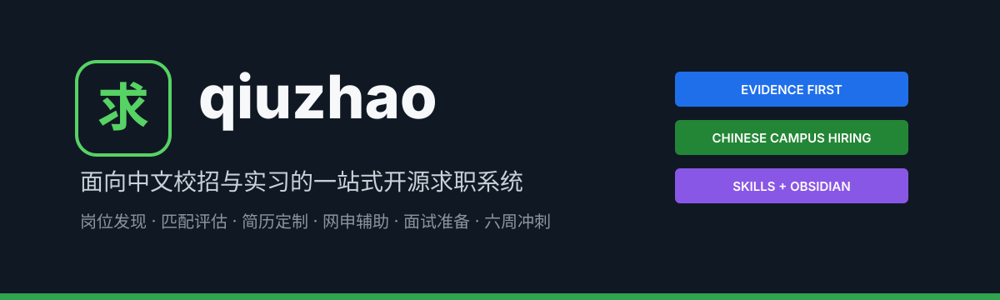

<div align="center">
  
</div>

<div align="center">

[](LICENSE)
[](https://www.python.org/)
[](https://github.com/luosir1123-ai/qiuzhao/actions/workflows/validate.yml)
[](skills/)
[](6周冲刺八股和力扣/)

**[快速开始](#快速开始) · [能力地图](#能力地图) · [六周冲刺](#六周冲刺八股与力扣) · [工作流](#完整求职工作流) · [贡献](#开发与贡献)**

[English](README.md)

</div>

---

## qiuzhao 是什么？

`qiuzhao` 是一套面向中文校招与实习申请的开源求职系统。它把分散的岗位搜索、匹配判断、简历修改、网申填写、面试准备和日常学习，组织成一条可以执行、验证与复盘的工作流。

它包含两个彼此独立、又可以组合使用的部分：

| 入口 | 适合场景 | 你会得到什么 |
|---|---|---|
| [求职 Skills](skills/) | 已经有 JD、简历或网申页面，希望获得针对性协助 | 岗位排名、简历改写、字段映射、面试题包 |
| [六周冲刺：八股与力扣](6周冲刺八股和力扣/) | 基础薄弱、已经开始投递，需要系统补齐面试能力 | 42 天计划、每日任务、算法记录、八股笔记、模拟面试 |

> [!IMPORTANT]
> `qiuzhao` 不替你编造经历，也不承诺获得 Offer。所有匹配结论、项目描述和面试回答都应回到真实证据；登录、验证码、声明和最终提交始终由用户本人确认。

## 为什么做这个项目？

中文校招准备经常遇到四个问题：

1. **岗位很多，但不知道是否真的符合硬条件。** 届别、学历、专业、地点和语言要求常被模糊的“匹配分”掩盖。
2. **简历修改容易变成关键词堆砌。** 内容看似贴合 JD，却经不起项目追问或事实核验。
3. **网申字段重复且容易冲突。** 简历、个人资料和表单之间缺少统一口径。
4. **学习计划与真实面试脱节。** 收藏了大量题单和八股，却不能限时写代码、口述原理或解释项目取舍。

`qiuzhao` 的做法是：把硬条件放在前面，把事实证据保留下来，把每一步产物交给下一步继续使用。

## 完整求职工作流

```text
招聘官网 / JD
       │
       ▼
┌──────────────┐   硬条件、证据、缺口   ┌──────────────┐
│ 岗位发现与筛选 │ ───────────────────▶ │  岗位匹配排序  │
└──────────────┘                       └──────┬───────┘
                                             │ 首选岗位
                                             ▼
┌──────────────┐   字段一致性与人工确认  ┌──────────────┐
│   网申辅助    │ ◀─────────────────── │   简历定制    │
└──────┬───────┘                       └──────────────┘
       │ 面试邀请
       ▼
┌──────────────┐   暴露缺口与学习证据   ┌────────────────────┐
│   面试准备    │ ───────────────────▶ │ 六周冲刺 / 定向补缺 │
└──────────────┘                       └────────────────────┘
```

每个步骤都输出结构化结果，而不是只给一句结论：

- **证据**：简历、项目、实验或官方 JD 中可以核验的事实。
- **推断**：根据事实得出的判断，明确标记为推断。
- **缺口**：当前没有证据支持或尚未掌握的部分。
- **未知**：页面未展示、资料不足或需要用户确认的信息。

## 能力地图

### 1. 岗位匹配 `job-fit-ranker`

从招聘官网或完整 JD 中提取真实要求，先检查硬条件，再结合简历证据进行排序。

| 输入 | 核心处理 | 输出 |
|---|---|---|
| 招聘官网、岗位链接、JD、候选人资料 | 届别/学历/专业等硬条件；职责与技能匹配；证据强度 | 岗位排名、匹配分、硬门槛、证据、缺口、官方链接 |

适合回答：**我应该优先投哪些岗位？哪些岗位看起来相关，但实际上不满足条件？**

### 2. 简历定制 `jd-resume-tailor`

针对一个目标 JD，调整已有简历的表达顺序、关键词和成果呈现，同时保持事实边界。

| 输入 | 核心处理 | 输出 |
|---|---|---|
| 目标 JD、现有简历、可验证经历 | 需求映射、内容取舍、ATS 表达、事实检查 | 定制建议、改写内容、关键词覆盖、核验清单 |

适合回答：**哪些经历值得放到前面？怎样贴近岗位而不夸大项目？**

### 3. 网申辅助 `application-form-helper`

把简历和候选人资料映射到中文 ATS 表单，发现缺失项与互相冲突的信息。

| 输入 | 核心处理 | 输出 |
|---|---|---|
| 简历、个人资料、网申字段 | 字段映射、格式转换、时间线和分类一致性检查 | 填写计划、缺失项、冲突提示、提交前检查 |

适合回答：**同一段经历应该填在哪一栏？为什么简历和网申时间对不上？**

> [!WARNING]
> 该 Skill 可以协助起草和填写，但不会绕过登录、验证码、身份校验、声明或最终提交确认。

### 4. 面试准备 `interview-prep`

根据 JD 和真实简历证据，生成技术问题、项目深挖、行为问题、追问以及缺口修复计划。

| 输入 | 核心处理 | 输出 |
|---|---|---|
| JD、简历、面试阶段、准备时间 | 概率与影响排序；项目证据映射；对抗性追问 | 高频问题、回答提纲、项目深挖、补齐计划、反问问题 |

适合回答：**面试官最可能追问什么？我的项目描述哪里最容易被问穿？**

## 六周冲刺：八股与力扣

[六周冲刺：八股与力扣](6周冲刺八股和力扣/) 是一个可以直接作为 Obsidian Vault 打开的 42 天学习系统，面向已经开始投递、但 Python 与算法基础薄弱的 AI Agent / RAG 应用开发候选人。

### 每天 6 小时

| 训练线 | 每天 | 强制产物 |
|---|---:|---|
| Python | 60 分钟 | 一个闭卷小程序与边界测试 |
| 算法 | 90 分钟 | 一道新题、一道复习题及复杂度分析 |
| 计算机基础 | 75 分钟 | 一组可以口述的主问题与追问 |
| Agent / RAG | 75 分钟 | 一篇概念笔记或可复现实验 |
| 项目 / 模拟面试 | 30 分钟 | 一段录音、项目解释或限时模拟 |
| 投递 / 复盘 | 30 分钟 | 状态更新、证据链接和次日优先级 |

### 六周路线

| 周次 | 目标 | 核心内容 | 阶段验收 |
|---|---|---|---|
| Week 1 | 建立最低面试能力 | Python 基础、数组/哈希、三大基础八股、RAG 链路 | 闭卷小程序、基础手撕、首次模拟 |
| Week 2 | 独立完成基础代码 | 类与异常、链表/滑窗、GIL 与数据库锁、RAG 数据处理 | 45 分钟模拟与首次错题复习 |
| Week 3 | 建立常见解题框架 | 生成器/异步、树与搜索、Redis、Agent 工作流 | 独立讲清 Agent 请求链路 |
| Week 4 | 补齐岗位专项工程 | FastAPI、回溯/DP、可靠性、混合检索与评估 | 小型 API 与检索实验记录 |
| Week 5 | 强化限时表现 | 图/并查集、部署监控、MCP、安全与降级 | 两次手撕、两次综合模拟 |
| Week 6 | 查漏补缺 | 错题二刷、JD 定向、项目指标与综合复盘 | 阶段报告与真实就绪度评分 |

### 直接开始

- [学习总览](6周冲刺八股和力扣/00-Dashboard/学习总览.md)
- [Day 01：第一天完整任务](6周冲刺八股和力扣/07-Daily/2026-08-14-Day01.md)
- [42 天每日任务卡](6周冲刺八股和力扣/08-Weekly/每日任务卡.md)
- [每日执行协议](6周冲刺八股和力扣/08-Weekly/每日执行协议.md)
- [六周总路线](6周冲刺八股和力扣/08-Weekly/六周总路线.md)
- [学习记录模板](6周冲刺八股和力扣/Templates/每日学习模板.md)

## 快速开始

### 安装全部 Skills

```bash
npx skills add luosir1123-ai/qiuzhao -g
```

### 只安装一个 Skill

```bash
npx skills add luosir1123-ai/qiuzhao --skill job-fit-ranker -g
```

可选 Skill 名称：

- `job-fit-ranker`
- `jd-resume-tailor`
- `application-form-helper`
- `interview-prep`

### 从本地仓库安装

```bash
git clone https://github.com/luosir1123-ai/qiuzhao.git
cd qiuzhao
npx skills add . -g
```

### 打开六周学习 Vault

1. 克隆仓库。
2. 打开 Obsidian，选择 **Open folder as vault**。
3. 选择仓库中的 `6周冲刺八股和力扣` 目录。
4. 从 `00-Dashboard/学习总览.md` 开始。

社区插件不是必需项。所有核心内容均使用标准 Markdown、YAML 和相对链接，可以直接在 GitHub 阅读。

## 使用示例

下面的身份和公司均为虚构示例：

```text
我是一名 2027 届计算机专业硕士，准备申请 example.com 上的 AI 应用开发岗位。

1. 使用 $job-fit-ranker 阅读官方岗位页面，检查届别、学历和专业硬条件，输出 Top 5。
2. 对排名第一的岗位使用 $jd-resume-tailor，只根据我的真实项目和实验结果改写简历。
3. 收到网申后，使用 $application-form-helper 检查简历与表单中的时间、分类和字段冲突。
4. 面试前使用 $interview-prep 生成项目深挖与技术追问，并把暴露的缺口加入六周冲刺计划。
```

## 仓库结构

```text
qiuzhao/
├── skills/                     # 4 个可安装的求职 Skills
├── shared/references/          # 候选人、匹配、输出和安全契约
├── templates/                  # 虚构候选人资料模板
├── 6周冲刺八股和力扣/          # 42 天 Obsidian 学习系统
├── tests/                      # 仓库验证测试
├── scripts/                    # 结构与隐私检查
├── README.zh-CN.md             # 中文完整指南
└── README.md                   # English overview
```

## 设计原则

- **证据优先**：所有匹配、改写与回答都对应真实资料，不把推断写成事实。
- **硬条件优先**：届别、学历、专业、语言和地点要求先于综合匹配分。
- **分类准确**：实习、工作、项目、科研与校园经历不相互冒充。
- **隐私本地化**：仓库不需要上传真实简历，也不提供托管后端。
- **人工最终确认**：不绕过验证码、身份校验、声明和最终提交按钮。
- **输出驱动学习**：刷题通过不等于掌握，必须留下闭卷代码、复杂度、口述或实验证据。

## 局限

- 招聘网站结构、岗位状态与 JD 可能随时变化，工具必须报告实际检查范围。
- 登录、反自动化、不可见分页和区域限制可能影响岗位覆盖。
- 匹配分用于排序与发现缺口，不代表录用概率。
- 六周计划默认每天投入 6 小时，应根据真实面试日期和个人状态调整。
- 项目不提供法律、就业或录用保证。

## 开发与贡献

运行完整检查：

```bash
python3 -m unittest discover -v
python3 scripts/validate.py
python3 scripts/check_private_data.py .
python3 "6周冲刺八股和力扣/scripts/validate_vault.py"
```

贡献内容必须使用虚构身份与 `example.com` 邮箱，不得提交真实简历、电话号码、证件号码、凭证或本地用户路径。详见 [AGENTS.md](AGENTS.md) 与 [CONTRIBUTING.md](CONTRIBUTING.md)。

## License

[MIT](LICENSE)
